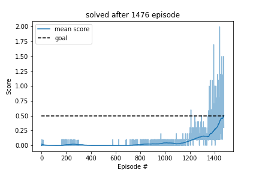

# 1. Learning Algorithm

## Agent and DDPG Algorithm
The agents use deterministic deep policy gradient (DDPG) as described in [this](https://arxiv.org/abs/1509.02971) article and already used in [this](https://github.com/AdrianTrachte/udacity-drlnd-p2_continuous-control) project. Each agent has one critic network evaluating the current state and action and an actor network returning continuous actions to a given (continuous) state. For both, critic and actor, local and target networks are used. As each agent gets its own local observation the experiences can be shared. Therefore only one shared replay buffer is used.

The principal algorithm as given in the [paper](https://arxiv.org/abs/1509.02971) is extended to multiple agents with one shared replay buffer:
* **Initialize** shared replay buffer R
* **Initialize** local and target critic networks Q, Q' and local and target actor network μ, μ' for each agent
* **Loop** over episodes
* --**Initialize** a random process N for exploration for each agent
* --**Receive** initial observation state s for each agent
* --**Loop** over time steps 
* ----**Select action** a_t = μ(s_t | θ_μ) + N_t according to policy and exploration noise for each agent
* ----**Execute** actions and observe rewards r_t and new states s_t+1 for each agent
* ----**Store** transition (s_t, a_t, r_t, s_t+1) in R for each agent
* ----**Sample** minibatch of n transitions (s_i, a_i, r_i, s_i+1) from R for each agent
* ----**Set** y_i = r_i + γQ'(s_i+1, μ'(s_i+1 | θ_μ') | θ_Q') for each agent
* ----**Update Critic** by minimizing loss L = 1/n Σ_i (y_i - Q(s_i, a_i | θ_Q))^2 with respect to θ_Q for each agent
* ----**Update Policy** by minimizing actor loss J = -Q(s_i, μ(s_i | θ_μ)) with respect to θ_μ for each agent
* ----**Soft transition** from local to target networks Q --> Q', μ --> μ' for each agent
* --**End Loop**
* **End Loop**

TODO: check parameters

Where these steps are repeated for each step in each episode. Note that the epsilon value for choosing the action epsilon greedy is reduced linearly over episodes, starting with `eps_start = 1.0` and ending at `eps_end = 0.01` after `eps_nEpisodes = 4000`. 

Further agent hyperparameters are:

	GAMMA = 0.99            # discount factor
	TAU = 1e-3              # for soft update of target parameters
	LR_CRIT = 1e-3          # learning rate critic
	LR_ACTR = 1e-4          # learning rate actor (should be smaller than critic)
	WEIGHT_DECAY = 0        # L2 weight decay
	UPDATE_EVERY = 1        # how often to update the network, 1 = every step, 2 = every 2nd step, ...
	GD_EPOCH = 1            # how often to optimize when learning is triggered
	CLIP_GRAD = 1           # clippin gradient with this value
		
As optimizer `Adam` has been used.

## Neural Network
As the observation space of the environment for each agent is `state_size = 24` and `action_size = 2`, the input size of the critic network Q(s_i, a_i | θ_Q) is 26 and output size is 1. The input size of the actor μ(s_i | θ_μ) is equal to the state size 24. For both networks two linear hidden layers are used, with size `hidden_layers = [256, 128]` for the critic and actor, with `relu` activation. For the actor the output function `tanh` is used to keep outputs between -1 and 1.

# 2. Plot of Rewards
With the above described agent the environment has been solved in TODO: 1858 episodes. The development of average rewards as well with all scores over each episode are provided below.

Without exploration a mean score of TODO can be reached.

# 4. Ideas for Future Work
- Implement Prioritized Experience Replay as described in this [paper](https://arxiv.org/abs/1511.05952) or for DDPG in this [paper](https://ieeexplore.ieee.org/abstract/document/8122622)
- Use a PPO algorithm instead of DDPG as can be found in this [paper](https://arxiv.org/pdf/1707.06347.pdf)